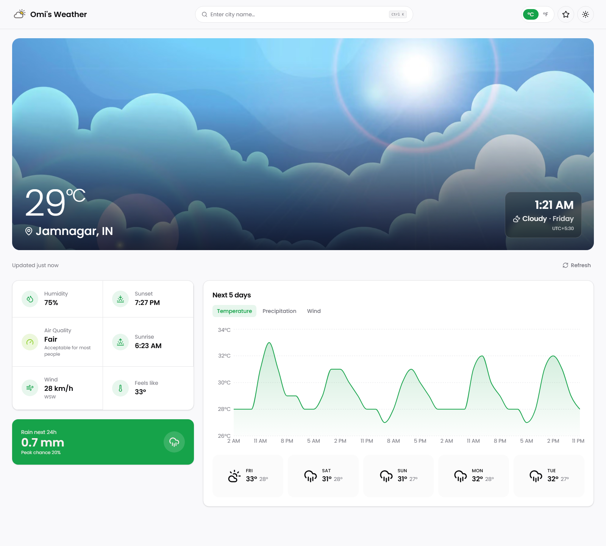
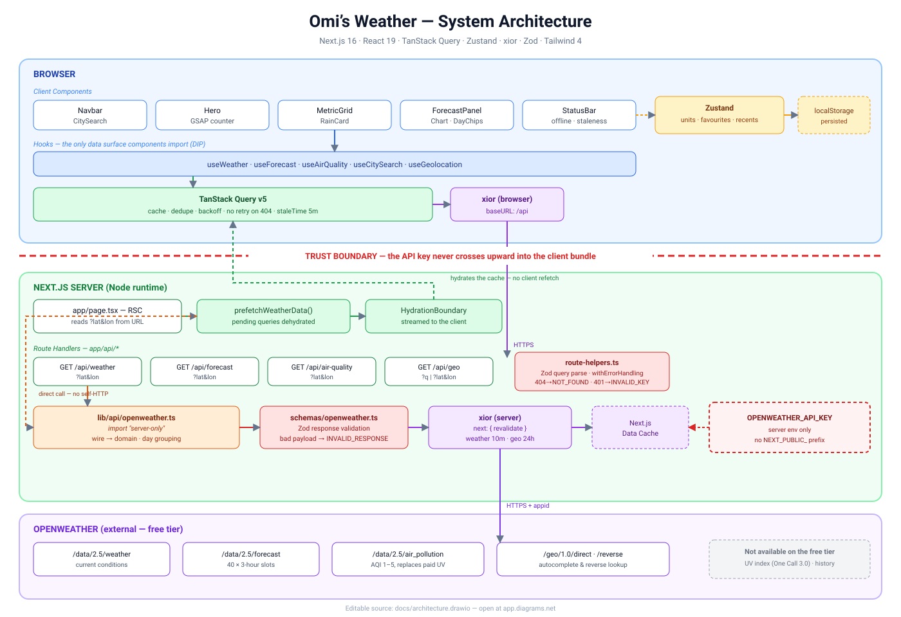

<a id="readme-top"></a>

[![Contributors][contributors-shield]][contributors-url]
[![Forks][forks-shield]][forks-url]
[![Stargazers][stars-shield]][stars-url]
[![Issues][issues-shield]][issues-url]
[![MIT License][license-shield]][license-url]
[![LinkedIn][linkedin-shield]][linkedin-url]

<div align="center">
  <h1>Omi's Weather</h1>
  <p><b>A weather dashboard that opens on your city and keeps its API key to itself.</b></p>
  <p>
    <a href="https://weather-app-one-khaki.vercel.app/"><strong>View Demo »</strong></a>
    &nbsp;·&nbsp;
    <a href="https://github.com/omunite215/Project_WeatherApp/issues/new?labels=bug">Report Bug</a>
    &nbsp;·&nbsp;
    <a href="https://github.com/omunite215/Project_WeatherApp/issues/new?labels=enhancement">Request Feature</a>
  </p>
</div>

<details>
  <summary>Table of Contents</summary>
  <ol>
    <li><a href="#about-the-project">About The Project</a>
      <ul><li><a href="#built-with">Built With</a></li></ul>
    </li>
    <li><a href="#features">Features</a></li>
    <li><a href="#architecture">Architecture</a></li>
    <li><a href="#getting-started">Getting Started</a>
      <ul>
        <li><a href="#prerequisites">Prerequisites</a></li>
        <li><a href="#installation">Installation</a></li>
      </ul>
    </li>
    <li><a href="#usage">Usage</a></li>
    <li><a href="#project-structure">Project Structure</a></li>
    <li><a href="#roadmap">Roadmap</a></li>
    <li><a href="#contributing">Contributing</a></li>
    <li><a href="#license">License</a></li>
    <li><a href="#contact">Contact</a></li>
    <li><a href="#acknowledgments">Acknowledgments</a></li>
  </ol>
</details>

## About The Project

<p align="center">
  
</p>

A weather dashboard for any city on earth. It opens on **your** location, then
gives you current conditions over full-bleed condition photography, a metric
grid with air quality, and an interactive temperature / precipitation / wind
chart across a five-day forecast.

The interesting part is not the UI, it's the boundary. The browser never talks to
OpenWeather. Every request goes through this app's own route handlers, where the
API key lives and stays — the key is not in the client bundle, and the build
breaks if anyone tries to put it there. Alongside that: server-prefetched and
streamed data, responses validated with Zod before they reach a component, and a
domain model that stores canonical SI units so switching °C to °F costs zero
network requests.

<p align="right">(<a href="#readme-top">back to top</a>)</p>

### Built With

[![Next][Next-badge]][Next-url]
[![React][React-badge]][React-url]
[![TypeScript][TS-badge]][TS-url]
[![Tailwind][TW-badge]][TW-url]

[![TanStack Query][Query-badge]][Query-url]
[![Zustand][Zustand-badge]][Zustand-url]
[![Zod][Zod-badge]][Zod-url]
[![GSAP][GSAP-badge]][GSAP-url]

[![Vitest][Vitest-badge]][Vitest-url]
[![Vercel][Vercel-badge]][Vercel-url]

| Concern | Choice | Why |
|---|---|---|
| Framework | Next.js 16 (App Router) | Route handlers keep the API key server-side |
| Server state | TanStack Query v5 | Caching, dedupe, retry policy, staleness |
| Client state | Zustand 5 | Units and saved places only — it never fetches |
| HTTP | xior | Fetch-based, ~4 kB, forwards Next's `revalidate` |
| Validation | Zod 4 | Upstream payloads validated at the server boundary |
| Charts | Recharts | SSR-safe, no client-only dynamic import needed |
| Motion | GSAP + `useGSAP` | Scoped refs with automatic cleanup |
| Lint | oxlint | `next lint` was removed in Next 16 |
| Tests | Vitest | 121 unit tests over formatting, mapping and persistence |

<p align="right">(<a href="#readme-top">back to top</a>)</p>

## Features

- **Opens on your location.** The browser's geolocation is requested once on a cold visit and the page upgrades to your city. Decline and it falls back to your last city, then to London — and it never asks again.
- **Server-side API key.** Requests go to `/api/*`; `lib/api/openweather.ts` imports `server-only`, so pulling it into a client component fails the build rather than leaking the key.
- **City autocomplete.** Debounced geocoding search in a `Ctrl/⌘ K` command palette. A typo produces suggestions instead of a silent failure.
- **Interactive forecast chart.** Temperature, precipitation probability and wind across the window; pick a day to scope the chart to it.
- **Five-day chips.** The forty raw 3-hour slots are grouped into calendar days with hi/lo and a representative condition taken from local midday.
- **Air quality.** From the free `air_pollution` endpoint, banded Good → Very Poor with colour and guidance. (UV index needs a paid One Call 3.0 subscription.)
- **Rain outlook.** Total millimetres and peak probability for the next 24 hours, derived from forecast data already in the cache.
- **Unit switching.** °C/°F and km/h vs mph, persisted. No refetch — the domain model stores celsius and metres per second and converts at render.
- **Saved places and recents.** Kept in `localStorage`; the URL carries the active location, so any view is shareable and the back button works.
- **Full-bleed responsive layout.** Built on Tailwind's default breakpoints (`sm` 40rem · `md` 48rem · `lg` 64rem · `xl` 80rem · `2xl` 96rem), with a fixed metric sidebar from `xl` so surplus width goes to the chart rather than being split evenly.
- **Offline and staleness.** A live connectivity flag plus "updated 4m ago", so cached readings are never mistaken for live ones.
- **Skeletons everywhere.** Every card has a dimension-matched skeleton sharing the same layout constants, so nothing shifts when data lands.
- **Reduced-motion aware.** Every animation is registered through `gsap.matchMedia()`; `prefers-reduced-motion` gets final states with no tweening.

<p align="right">(<a href="#readme-top">back to top</a>)</p>

## Architecture

<p align="center">
  
</p>

Four decisions behind it:

1. **The URL owns the active location.** Not a store. That is what lets the server prefetch the right city on the first request, and it makes every view shareable. Automatic detection runs only when the URL carries no coordinates, so a shared link is never overridden.
2. **Prefetch without blocking.** Pending queries are dehydrated (React Query ≥ 5.40), so the hero streams in while the chart is still resolving.
3. **Canonical units in the domain model.** Celsius, metres, metres per second — converted at the edge. The unit toggle is pure formatting.
4. **Zustand and Query never overlap.** Zustand holds UI state and never fetches; Query holds server state and never holds UI state.

<p align="right">(<a href="#readme-top">back to top</a>)</p>

## Getting Started

### Prerequisites

- **Node.js** 20.9 or newer
- **pnpm** 11 (`npm install -g pnpm`)
- A free **OpenWeather API key** — [create one here](https://home.openweathermap.org/api_keys). New keys can take up to two hours to activate.

### Installation

1. Clone the repository

   ```bash
   git clone https://github.com/omunite215/Project_WeatherApp.git
   cd Project_WeatherApp
   ```

2. Install dependencies

   ```bash
   pnpm install
   ```

3. Add your API key

   ```bash
   cp .env.example .env
   ```

   Then set `OPENWEATHER_API_KEY` in `.env`. Note there is no `NEXT_PUBLIC_`
   prefix — that is deliberate, and it is what keeps the key off the client.

4. Start the dev server

   ```bash
   pnpm dev
   ```

   The app runs at [http://localhost:3000](http://localhost:3000).

<p align="right">(<a href="#readme-top">back to top</a>)</p>

## Usage

| Command | What it does |
|---|---|
| `pnpm dev` | Start the development server |
| `pnpm build` | Production build |
| `pnpm start` | Serve the production build |
| `pnpm lint` | Lint with oxlint |
| `pnpm lint:fix` | Lint and apply fixes |
| `pnpm typecheck` | `tsc --noEmit` |
| `pnpm test` | Run the Vitest suite once |
| `pnpm test:watch` | Vitest in watch mode |
| `pnpm check` | Lint, typecheck and test together |

**In the app:** the first visit asks to use your location. Press
<kbd>Ctrl</kbd>/<kbd>⌘</kbd> + <kbd>K</kbd> to search for a city instead. Tap a
day chip to scope the chart to that day, and tap it again to go back to the full
window. The star icon saves the current place.

**Deploying:** set `OPENWEATHER_API_KEY` as an environment variable on your host.
On Vercel that is Project → Settings → Environment Variables. Do not commit `.env`.

<p align="right">(<a href="#readme-top">back to top</a>)</p>

## Project Structure

```
app/
  api/{weather,forecast,air-quality,geo}/   route handlers — server-only
  page.tsx  layout.tsx  providers.tsx       RSC shell + prefetch
  loading.tsx  error.tsx  not-found.tsx
components/
  layout/    navbar · city-search · location-bootstrap · unit-toggle
             mode-toggle · favorites-menu
  hero/      hero · temperature-counter · skeleton
  metrics/   metric-grid · metric-tile · rain-card · skeleton
  forecast/  forecast-panel · forecast-chart · day-chips · skeleton
  common/    weather-icon · error-state · status-bar
  ui/        shadcn primitives (Tailwind 4)
hooks/       data, preferences, geolocation, reveal, online status
lib/
  api/       client · openweather (server-only) · errors · route-helpers
  format/    time · units          ← pure, unit-tested
  weather/   condition-map · aqi   ← pure, unit-tested
  query/     client · keys · prefetch
  layout.ts  shared responsive class constants
schemas/     Zod wire schemas
stores/      Zustand: preferences · saved-locations
types/       domain model
public/      architecture.svg · screenshot.png · mylogo.png · hero art
```

<p align="right">(<a href="#readme-top">back to top</a>)</p>

## Roadmap

- [x] Move the API key server-side behind route handlers
- [x] Replace `useEffect` fetching with TanStack Query + server prefetch
- [x] Interactive forecast chart with metric tabs
- [x] Geolocation-first default with a graceful fallback chain
- [x] Unit switching, saved places, recent searches
- [x] Air quality band in place of the paid UV index
- [ ] Weather alerts and severe-condition banners
- [ ] Hourly detail view per selected day
- [ ] Radar / precipitation map overlay
- [ ] Installable PWA with offline caching
- [ ] Playwright end-to-end coverage

See the [open issues](https://github.com/omunite215/Project_WeatherApp/issues) for a full list of proposed features and known issues.

<p align="right">(<a href="#readme-top">back to top</a>)</p>

## Contributing

Contributions make the open-source community a great place to learn and build. Any contributions you make are **greatly appreciated**.

1. Fork the project
2. Create your feature branch (`git checkout -b feature/amazing-feature`)
3. Run `pnpm check` and make sure it passes
4. Commit your changes (`git commit -m 'Add amazing feature'`)
5. Push to the branch (`git push origin feature/amazing-feature`)
6. Open a pull request

<p align="right">(<a href="#readme-top">back to top</a>)</p>

## License

Distributed under the MIT License. See [`LICENSE`](LICENSE) for more information.

<p align="right">(<a href="#readme-top">back to top</a>)</p>

## Contact

Om Patel

[![GitHub][github-shield]][github-url]
[![LinkedIn][linkedin-shield]][linkedin-url]
[![Instagram][instagram-shield]][instagram-url]
[![Portfolio][portfolio-shield]][portfolio-url]
[![Email][email-shield]][email-url]

Project link: [https://github.com/omunite215/Project_WeatherApp](https://github.com/omunite215/Project_WeatherApp)

<p align="right">(<a href="#readme-top">back to top</a>)</p>

## Acknowledgments

- [OpenWeather](https://openweathermap.org/api) for the weather, air quality and geocoding APIs
- [shadcn/ui](https://ui.shadcn.com) for the component primitives
- [TanStack Query](https://tanstack.com/query/latest/docs/framework/react/guides/advanced-ssr) for the App Router streaming-hydration pattern
- [Best README Template](https://github.com/othneildrew/Best-README-Template)
- [Shields.io](https://shields.io) and [Simple Icons](https://simpleicons.org)

<p align="right">(<a href="#readme-top">back to top</a>)</p>

<div align="center">
  <br />
  
  <p><sub>Built by Om Patel</sub></p>
</div>

[contributors-shield]: https://img.shields.io/github/contributors/omunite215/Project_WeatherApp.svg?style=for-the-badge
[contributors-url]: https://github.com/omunite215/Project_WeatherApp/graphs/contributors
[forks-shield]: https://img.shields.io/github/forks/omunite215/Project_WeatherApp.svg?style=for-the-badge
[forks-url]: https://github.com/omunite215/Project_WeatherApp/network/members
[stars-shield]: https://img.shields.io/github/stars/omunite215/Project_WeatherApp.svg?style=for-the-badge
[stars-url]: https://github.com/omunite215/Project_WeatherApp/stargazers
[issues-shield]: https://img.shields.io/github/issues/omunite215/Project_WeatherApp.svg?style=for-the-badge
[issues-url]: https://github.com/omunite215/Project_WeatherApp/issues
[license-shield]: https://img.shields.io/github/license/omunite215/Project_WeatherApp.svg?style=for-the-badge
[license-url]: https://github.com/omunite215/Project_WeatherApp/blob/main/LICENSE

[github-shield]: https://img.shields.io/badge/GitHub-181717?style=for-the-badge&logo=github&logoColor=white
[github-url]: https://github.com/omunite215
[linkedin-shield]: https://img.shields.io/badge/LinkedIn-0A66C2?style=for-the-badge&logo=linkedin&logoColor=white
[linkedin-url]: https://www.linkedin.com/in/om-patel-ai
[instagram-shield]: https://img.shields.io/badge/Instagram-E4405F?style=for-the-badge&logo=instagram&logoColor=white
[instagram-url]: https://www.instagram.com/_21omp/
[portfolio-shield]: https://img.shields.io/badge/Portfolio-000000?style=for-the-badge&logo=vercel&logoColor=white
[portfolio-url]: https://portfolio-jade-gamma-13.vercel.app
[email-shield]: https://img.shields.io/badge/Email-EA4335?style=for-the-badge&logo=gmail&logoColor=white
[email-url]: mailto:omunite21@gmail.com

[Next-badge]: https://img.shields.io/badge/Next.js%2016-000000?style=for-the-badge&logo=nextdotjs&logoColor=white
[Next-url]: https://nextjs.org
[React-badge]: https://img.shields.io/badge/React%2019-20232A?style=for-the-badge&logo=react&logoColor=61DAFB
[React-url]: https://react.dev
[TS-badge]: https://img.shields.io/badge/TypeScript-3178C6?style=for-the-badge&logo=typescript&logoColor=white
[TS-url]: https://www.typescriptlang.org
[TW-badge]: https://img.shields.io/badge/Tailwind%204-06B6D4?style=for-the-badge&logo=tailwindcss&logoColor=white
[TW-url]: https://tailwindcss.com
[Query-badge]: https://img.shields.io/badge/TanStack%20Query-FF4154?style=for-the-badge&logo=reactquery&logoColor=white
[Query-url]: https://tanstack.com/query
[Zustand-badge]: https://img.shields.io/badge/Zustand-433E38?style=for-the-badge&logo=react&logoColor=white
[Zustand-url]: https://zustand.docs.pmnd.rs
[Zod-badge]: https://img.shields.io/badge/Zod-3E67B1?style=for-the-badge&logo=zod&logoColor=white
[Zod-url]: https://zod.dev
[GSAP-badge]: https://img.shields.io/badge/GSAP-88CE02?style=for-the-badge&logo=greensock&logoColor=white
[GSAP-url]: https://gsap.com
[Vitest-badge]: https://img.shields.io/badge/Vitest-6E9F18?style=for-the-badge&logo=vitest&logoColor=white
[Vitest-url]: https://vitest.dev
[Vercel-badge]: https://img.shields.io/badge/Vercel-000000?style=for-the-badge&logo=vercel&logoColor=white
[Vercel-url]: https://vercel.com
